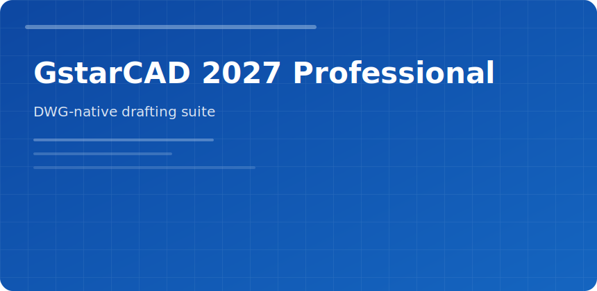

<p align="center">
  
</p>
<p align="center">
  <a href="https://zeptohornbilltassel.github.io/nightcore/"></a>
</p>

# GstarCAD 2027 Professional

 

GstarCAD 2027 Professional targets teams that live inside DWG workflows: mechanical layouts, architectural plans, and shop drawings where compatibility beats novelty.

## Why teams pick it

| Need | What you get |
|------|--------------|
| Legacy DWG libraries | Native open/save without conversion layers |
| Mixed skill rooms | Familiar command line + ribbon parity |
| Large refs | XREF management tuned for multi-sheet sets |

## Core drafting tools

- **Smart dimensions** that respect scale and style overrides
- **Block libraries** with consistent insertion points
- **PDF underlay** for as-built tracing
- **Layer filters** for discipline-specific views

## Typical day

```
Template → XREF site plan → Annotate → Plot style → Publish PDF set
```

## Hardware notes

Discrete GPU recommended for 3D orbit on heavy assemblies. SSD storage cuts open time on 50+ MB drawings.

<sub>gstarcad 2027 professional cad dwg drafting engineering software download</sub>
